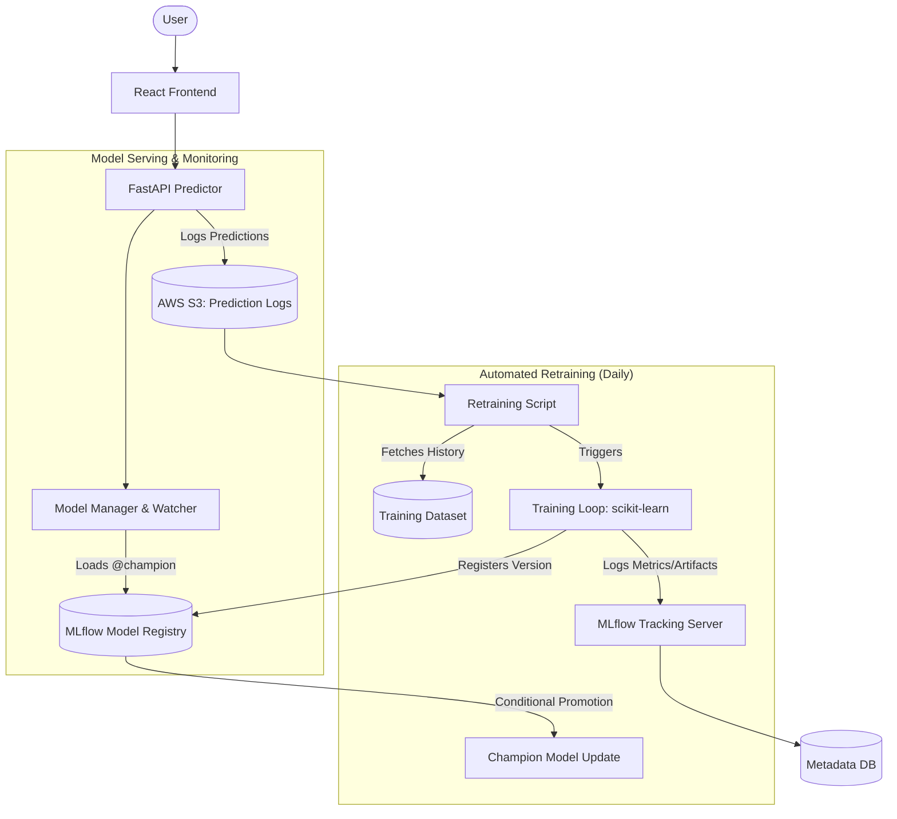

# 🛒 Buy/Wait Prediction System: End-to-End MLOps Solution

[](https://fastapi.tiangolo.com/)
[](https://mlflow.org/)
[](https://reactjs.org/)
[](https://aws.amazon.com/)
[](https://www.docker.com/)

An intelligent price-prediction engine that determines whether users should **Buy Now** or **Wait** for a price drop. This project isn't just a model; it's a complete **Production-Ready MLOps Pipeline** featuring automated retraining, experiment tracking, and robust model serving.

---

## 🏗️ System Architecture

The following diagram illustrates the closed-loop MLOps architecture, highlighting the flow from user interaction to automated model promotion.



---

## 🌟 Key Features

*   **Closed-Loop MLOps**: Automated retraining cycle that fetches production prediction logs from S3, merges them with historical data, and re-optimizes the model.
*   **Champion Model Registry**: Uses MLflow's "Champion" alias pattern to decouple model updates from code deployments. The API automatically hot-reloads when a new model is promoted.
*   **Time-Series Optimized**: Implements `TimeSeriesSplit` and custom feature engineering (rolling averages, volatility, price trends) to handle sequential data correctly.
*   **High Availability**: Model manager with background polling and thread-safe loading. Includes robust fallback patterns to serve the latest stable version if registry synchronization fails.
*   **Cloud-Native Deployment**: Fully Dockerized components with GitHub Actions CI/CD for AWS ECS (Fargate) deployment.

---

## 🛠️ Tech Stack

### Backend & AI
- **Python (FastAPI)**: High-performance asynchronous API for real-time inference.
- **scikit-learn**: Model development using Random Forest and Gradient Boosting.
- **Pandas/NumPy**: Feature engineering and data manipulation.
- **Joblib**: Efficient model serialization.

### MLOps & Data
- **MLflow**: Centralized experiment tracking, model versioning, and lifecycle management.
- **AWS S3**: Scalable storage for prediction log history and model artifacts.
- **SQLite**: Local metadata store for MLflow tracking.

### Frontend
- **React (Vite)**: Modern, responsive UI for real-time price tracking and prediction visualization.

### DevOps
- **Docker**: Containerization for environment parity.
- **GitHub Actions**: Automated CI/CD pipelines for testing, building, and deployment.
- **AWS ECS (Fargate)**: Serverless container orchestration.

---

## 🚀 MLOps Workflow

### 1. Training & Tracking
The training pipeline (`train.py`) performs an exhaustive search over multiple models using `GridSearchCV`. Every run is logged to MLflow with:
- **Parameters**: Hyperparameter settings.
- **Metrics**: Accuracy, Recall, Macro F1-Score.
- **Artifacts**: Classification reports, confusion matrices, and the serialized model.

### 2. Automated Retraining
Every day, an EventBridge trigger executes the retraining pipeline:
1.  **Ingestion**: Scrapes prediction logs from S3.
2.  **Processing**: Cleans and engineers features from new production data.
3.  **Validation**: Compares the new model's Macro F1 against the current `Champion`.
4.  **Promotion**: If the new model improves by >1%, it is automatically tagged as the new `Champion`.

### 3. Seamless Model Serving
The FastAPI service runs a **Model Watcher** (background thread). It polls MLflow for the `Champion` alias. When a change is detected, it loads the new artifacts and refreshes the inference engine without a server restart.

---

## 📦 Installation & Setup

### Prerequisites
- Python 3.11+
- Docker & Docker Compose
- AWS CLI configured

### Local Development
1. **Clone the repository**:
   ```bash
   git clone https://github.com/your-username/buy-wait-tws-project.git
   cd buy-wait-tws-project/Backend\ -\ TWS\ Project
   ```

2. **Setup virtual environment**:
   ```bash
   python -m venv venv
   source venv/bin/activate  # Or `.\venv\Scripts\Activate.ps1` on Windows
   pip install -r requirements.txt
   ```

3. **Run MLflow Server**:
   ```bash
   mlflow server --backend-store-uri sqlite:///mlflow.db --default-artifact-root ./mlruns --host 0.0.0.0 --port 5000
   ```

4. **Start the API**:
   ```bash
   cd "FAST API"
   uvicorn main:app --host 0.0.0.0 --port 9001 --reload
   ```

---

## 🔌 API Documentation

Once started, the interactive Swagger UI is available at `/docs`.

### POST `/predict/`
Primary inference endpoint.
*   **Request**: `{"product_name": "Product X", "price": 299.99}`
*   **Logic**: Fetches last 3+ days of history, executes feature engineering, runs champion model.
*   **Response**: Returns recommendation (`buy`/`wait`), confidence score, and interpreted level.

---

## 👨‍💻 Author
**Ankit Meher** - [LinkedIn](https://www.linkedin.com/in/ankit-meher/) | [GitHub](https://github.com/Meher-Ankit)
